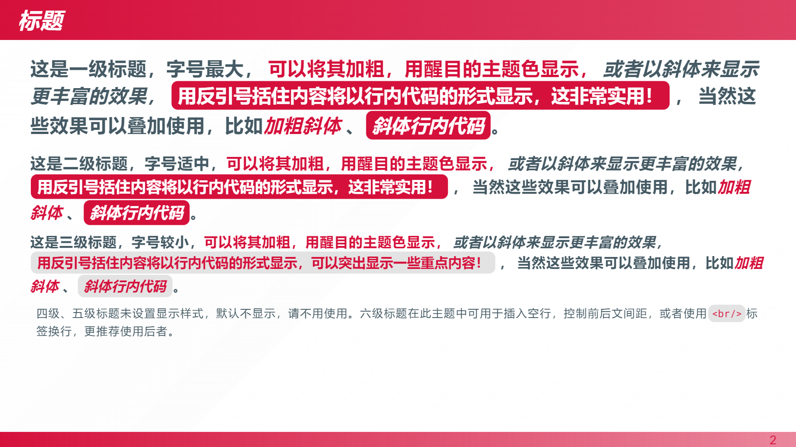
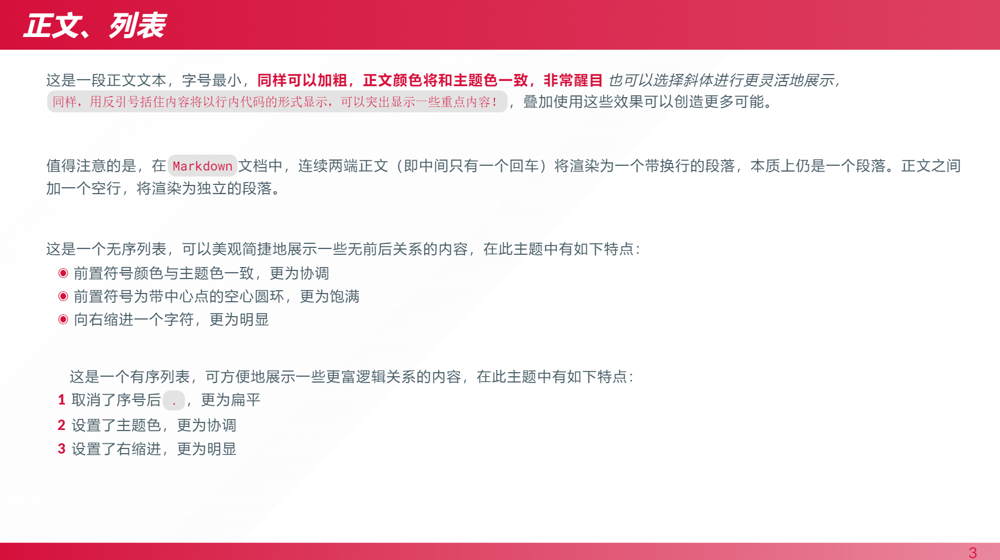
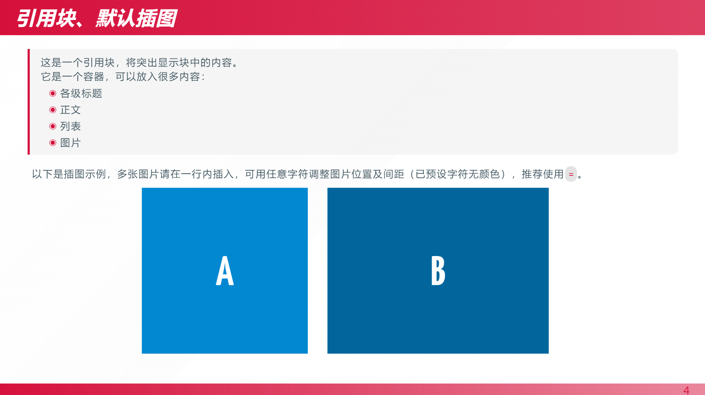
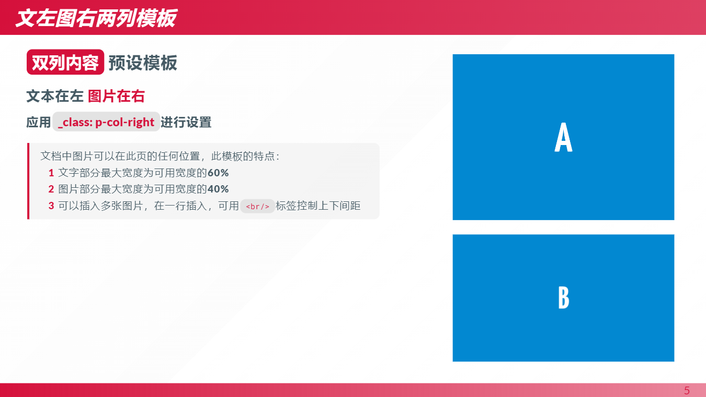
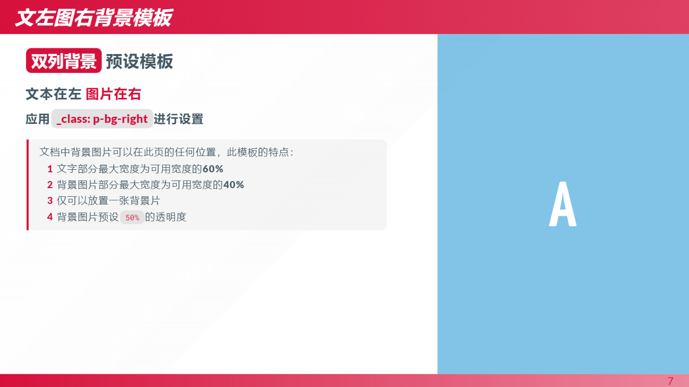

# marp-theme
Some custom Marp themes

该主题适用于Marp for VS Code工具。目前主要是`yj1.css`，基于marp官方主题`gaia`，偏向于传统幻灯片，设计上较为扁平，主要特点有：
* 定义了`header`和`footer`样式，用于显示幻灯片大标题和页码
* 优化了标题、正文、引用块等的样式
* 支持自定义主题色
* 添加了`cover` `p-col-right` `p-col-left`等样式，使图文排版更方便美观

# 安装使用
下载文件，直接放入工作路径，即可使用。`.vscode`中的`settings.json`文件已进行过配置，可在marp文档中直接调用。

```
    ---
    marp: true
    theme: yj1

    ---
```

# 样式说明
## `header` `footer`
```
<!--
header: 'XXX'
_footer: ' '
-->
```

## 标题
主题中可以使用一级标题、二级标题、三级标题，支持**粗体**、*斜体*、`行内代码`等样式，颜色与主题色保持一致。

四级标题、五级标题默认不显示，请勿使用。

六级标题可用作空行，内容预设为透明。



## 段落、列表
段落支持**粗体**、*斜体*、`行内代码`等样式，突出显示颜色为主题色。

列表样式已优化，符号和序号非常美观。


## 默认插图
多张图片请在一行内插入，可用任意字符调整图片位置及间距（已预设字符无颜色），推荐使用`=`。



# 特殊模板
## 封面`cover`
支持背景图片，全文居中，字体颜色可自定义。
```
<!-- 
_class: cover
_color: #FFFFFF
-->

```

## 图文两列`p-col-right` `p-col-left`
文本和图片分局两侧。
* 文字部分最大宽度为页面宽度的**60%**
* 图片部分最大宽度为页面宽度的**40%**
* 可以插入多张图片，在一行插入，可用`<br/>`标签控制上下间距
```
<!-- 
_class: p-col-right
-->
```

## 单侧背景图片`p-bg-right`
该主题中直接使用原生背景图片``会破坏`header`和`footer`元素，故推荐使用该模板。当然，如果不考虑在页面中放置`header`和`footer`元素，也可以使用原生的背景图片。
右置一张图片作为背景，最大宽度为页面宽度的**40%**。
```
<!-- 
_class: p-bg-right
-->
```

# 自定义主题色
通过`backgroundColor`可设置主题色，默认为`#d5103b`。

页面背景默认为纯白色，如有需要，可通过`backgroundImage`设置。
```
---
    marp: true
    theme: yj1
    backgroundColor: color
    backgroundImage: linear-gradient(to right, color1, color2)
---

```


